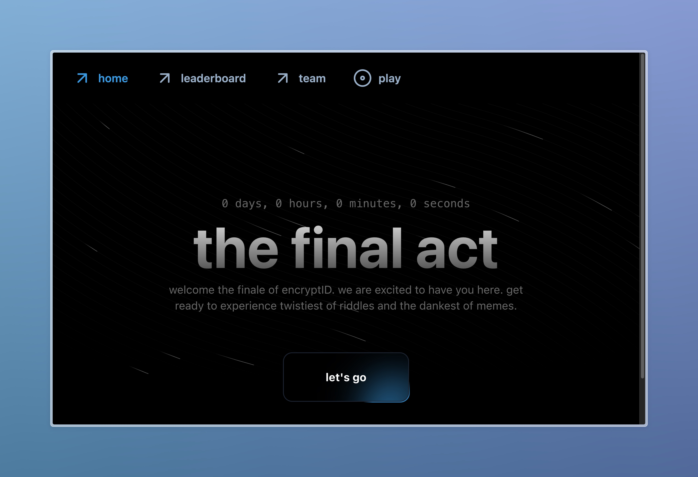

<center>

</center>

# EncryptID Finale Platform
This platform was used the for the 3rd & Final Edition of EncryptID, an online cryptic hunt based on anime, pop culture and more hosted by the COSMOS Tech Society of IIT Madras.

It's also being used for the [CryptIQ](https://cryptiq.iitmparadox.org) event organised by [pseudonymous123](https://github.com/Soham-Wani).



## Key Features
1. Google Sign In
2. Team Creation
3. Answer Logs
4. Images, Files and Code Comments for levels
5. Error Logging with Sentry
6. Disabling progression for non-verified emails

## Tech Stack
- Web App - **Sveltekit**
- Backend - **Firebase**
- Error Logging - **Sentry**
- Deployment - **Vercel**

## Setup 
### Firebase
1. Create a new firebase project and do the following:
- setup auth with google sign in provider enabled
- setup cloud firestore
- setup cloud storage (optional)

2. Create a new web app
Firebase will then give you a configuration object. This is your client configuration. Copy this to text file since we'll be needing it later.

3. Create a new service account
Create a new service account and download the credentials json file

### Web App
1. Clone the repository
```
git clone https://github.com/kry0sc0pic/encryptid-finale.git
```

2. Install Dependencies
```
npm install
```

3. Client Configuration

Edit `src/lib/firebase.ts` and replace `{}` with the client configuration from Step 2 of the firebase section.

4. Setup Environment Variables

Rename `.env.example` to `.env`. Set the values for the FB variables from the service account credentials you downloaded earlier in  step 3 of the firebase section.

### Sentry
1. Create a new sentry project with the platform as sveltekit.

2. Go to the project settings and copy the DSN value

3. Create a new auth token on your sentry organisation settings

4. Edit `.env` and set this auth token as the value for `SENTRY_AUTH_TOKEN` and set the dsn value for `PUBLIC_SENTRY_DSN`

### Firestore
1. Create the following collections/documents with the following data

`/index/userIndex`
```json
{"0":null}
```
`/index/nameIndex`
```json
{
  "teamcodes": [],
  "teamcounts": [],
  "teamnames": [],
  "usernames": []
}
```

2. Install and setup Firebase CLI
```
npm install -g firebase-cli
firebase login
firebase init
```
_make sure to select firestore indexes and security rules_

3. Deploy Security Rules and Indexes
```
firebase deploy --only firestore
```

### Discord Webhook (optional)
you can configure an optional discord webhook to receive messages when new users and teams are created along with the total count. 

To enable it, set the value for `WEBHOOK` to a valid discord webhook in `.env`

### Additional Configuration

If you are planning on using a platform other than vercel to deploy this, go to `svelte.config.js` and change the first import from `adapter-vercel` to `adapter-auto`.

## Star History

[](https://star-history.com/#kry0sc0pic/encryptid-finale&Date)

## License
This platform is licensed under the GNU GPL 3.0
